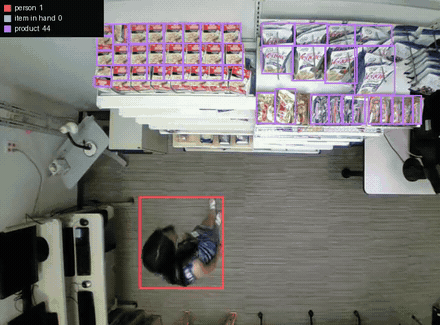
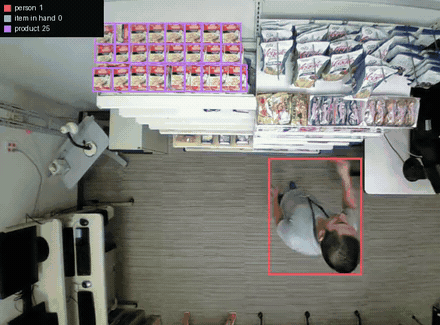
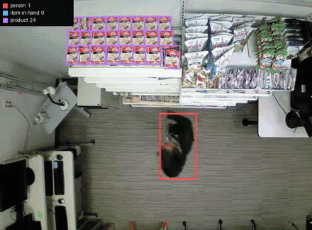

# cctv-goods-detection

Detecting goods moving in a grocery store from overhead camera footage.

Boxes below are produced by `nvidia/LocateAnything-3B` from typed phrases only —
`person`, `item in hand`, `product`. No training on this footage.

## Results

**21_1**



[merl-21_1.mp4](media/merl-21_1.mp4)

**1_1**



[merl-1_1.mp4](media/merl-1_1.mp4)

**31_1**



[merl-31_1.mp4](media/merl-31_1.mp4)

## Tools

```bash
# Locate by name in any frame of a clip
python3 tools/locate.py <clip> --at 2.5 --find "person,item in hand,product"

# Run across a clip and render an annotated video
python3 tools/locate_video.py <clip> --start 8 --dur 7 --every 12 \
    --moving "person,item in hand" --static "product" --out out.mp4

# Semantic segmentation baseline
python3 tools/segment.py <clip>
python3 tools/segment.py --list
```

`tools/ra_timing.py` maps RetailAction action labels onto video time via
`frame_timestamps`.

`player.html` browses clips with annotations drawn over the video. Needs the
datasets present and a local server:

```bash
python3 -m http.server 8000     # open localhost:8000/player.html
```

Requires `mlx-vlm` (Apple Silicon), `torch`, `transformers`, `ultralytics`,
`ffmpeg`, `pillow`, `numpy`, `scipy`.

## Data

Datasets are not included. Download them from their original sources.

Source footage above: MERL Shopping Dataset — Singh, Marks, Jones, Tuzel, Shao,
*A Multi-Stream Bi-Directional Recurrent Neural Network for Fine-Grained Action
Detection*, CVPR 2016.
